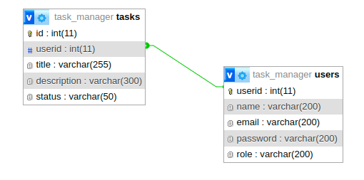

# Task Manager Backend App

---

## Developer Information

- **Name:** Nafi Ullah Shafin
- **Registration Number:** 2020831004
- **Department:** Software Engineering
- **Session:** 2020-2021

---

## Routes

### POST /users/register

- **Description:** Register a new user.
- **Body:**
  - name: String
  - email: String
  - password: String (hashed securely using bcrypt)
  - role: String
- **Response:**
  - message: 'User created successfully'

### POST /users/login

- **Description:** Login to the system.
- **Body:**
  - email: String
  - password: String
- **Response:**
  - message: "Login successful"
  - token: \<JWT Token\>

### GET /users

- **Description:** Get all users (protected route, accessible by admin).
- **Headers:**
  - x-auth-token: \<The token obtained while logging in as admin\>

### PUT /users/:userid

- **Description:** Update user information (protected route, accessible by admin).
- **Params:**
  - userid: String (ID of the user to be updated)
- **Body:**
  - name: String
  - email: String
  - password: String
  - role: String
- **Headers:**
  - x-auth-token: \<The token obtained while logging in as admin\>

### PUT /users/profile/:userid

- **Description:** Update user profile (protected route, accessible by any authenticated user).
- **Params:**
  - userid: String (ID of the user to update their own profile)
- **Body:**
  - name: String
  - email: String
  - password: String
- **Headers:**
  - x-auth-token: \<The token obtained while logging in as any role\>

### DELETE /users/:userid

- **Description:** Delete a user (protected route, accessible by any authenticated user).
- **Params:**
  - userid: String (ID of the user to be deleted)
- **Headers:**
  - x-auth-token: \<The token obtained while logging in as any role\>

---

### GET /tasks

- **Description:** Get all tasks (protected route, accessible by admin).
- **Headers:**
  - x-auth-token: \<The token obtained while logging in as admin\>
- **Query Parameters:**
  - status
  - sortBy
  - search
  - userid

### GET /usertask

- **Description:** Get tasks assigned to the user (protected route, accessible by any user).
- **Headers:**
  - x-auth-token: \<The token obtained while logging in as any role\>
- **Query Parameters:**
  - status
  - sortBy
  - search
  - userid

### POST /tasks

- **Description:** Create a new task (protected route, accessible by any user).
- **Body:**
  - title: String
  - description: String
  - status: String
- **Headers:**
  - x-auth-token: \<The token obtained while logging in as any role\>

### PUT /tasks/:id

- **Description:** Update a task (protected route, accessible by any user).
- **Params:**
  - id: String (ID of the task to be updated)
- **Body:**
  - title: String
  - description: String
  - status: String
- **Headers:**
  - x-auth-token: \<The token obtained while logging in as any role\>

### DELETE /tasks/:id

- **Description:** Delete a task (protected route, accessible by any user).
- **Params:**
  - id: String (ID of the task to be deleted)
- **Headers:**
  - x-auth-token: \<The token obtained while logging in as any role\>
